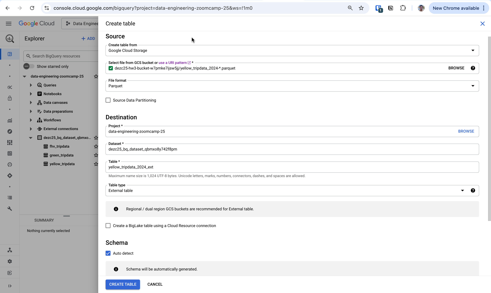
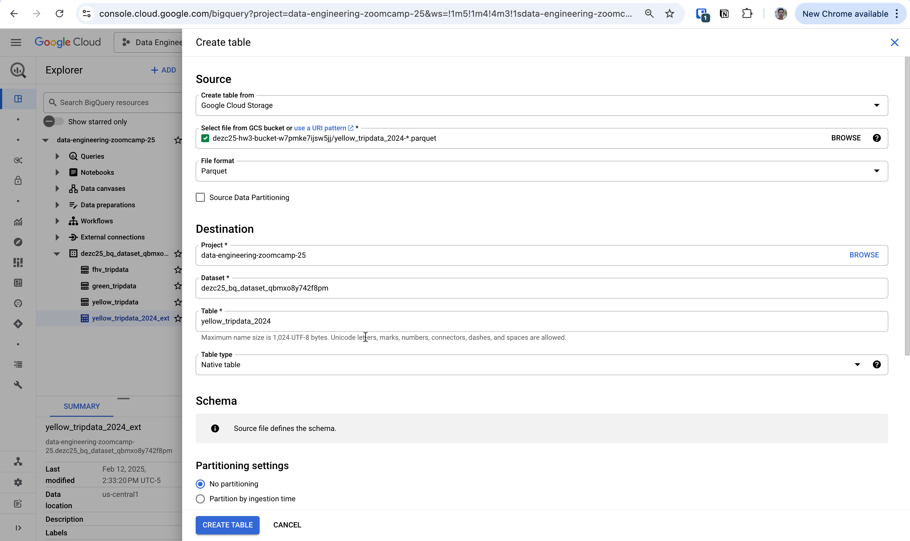

# My solutions to Module 3 Homework on Data Warehousing

## Create BigQuery external and materialized tables from Yellow Taxi data 2024 Jan-Jun in a GCP Bucket

Via SQL:

```sql
-- External table
CREATE OR REPLACE EXTERNAL TABLE `dezc25_bq_dataset_qbmxo8y742f8pm.yellow_tripdata_2024_ext`
OPTIONS (
  format = 'CSV',
  uris = ['gs://dezc25-hw3-bucket-w7pmke7ijsw5jj/yellow_tripdata_2024-*.parquet']
);

-- Materialized table
CREATE OR REPLACE TABLE `dezc25_bq_dataset_qbmxo8y742f8pm.yellow_tripdata_2024` AS
SELECT * 
FROM `dezc25_bq_dataset_qbmxo8y742f8pm.yellow_tripdata_2024_ext`;
```


Via GCP Console:

<figure>
    
    <figcaption>External table</figcaption>
</figure>

<figure>
    
    <figcaption>Materialized table</figcaption>
</figure>


## Question 1: What is count of records for the 2024 Yellow Taxi Data?
```sql
SELECT 
  COUNT(1) 
FROM 
  `dezc25_bq_dataset_qbmxo8y742f8pm.yellow_tripdata_2024`;
```
**Answer**: 20,332,093


## Question 2: What is the estimated amount of data that will be read when this query is executed on the External Table and the Table?
```sql
-- Count distinct PULocationID on external table
SELECT 
  COUNT(DISTINCT PULocationID) AS distinct_PULocationIDs
FROM 
  `dezc25_bq_dataset_qbmxo8y742f8pm.yellow_tripdata_2024_ext`;

-- Count distinct PULocationID on materialized table
SELECT 
  COUNT(DISTINCT PULocationID) AS distinct_PULocationIDs
FROM 
  `dezc25_bq_dataset_qbmxo8y742f8pm.yellow_tripdata_2024`;
```
**Answer**: 0 MB for the External Table and 155.12 MB for the Materialized Table.


## Question 3: Why are the estimated number of Bytes different?
Write a query to retrieve the PULocationID from the table (not the external table) in BigQuery. Now write a query to retrieve the PULocationID and DOLocationID on the same table. Why are the estimated number of Bytes different?

```sql
-- Selecting only PULocationID scans ~155.12 MB
SELECT 
  PULocationID
FROM 
  `dezc25_bq_dataset_qbmxo8y742f8pm.yellow_tripdata_2024`;

-- Select PULocationID and DOLocationID scans ~310.24 MB (twice as much)
SELECT 
  PULocationID,
  DOLocationID
FROM 
  `dezc25_bq_dataset_qbmxo8y742f8pm.yellow_tripdata_2024`;
```
**Answer**: BigQuery is a columnar database, and it only scans the specific columns requested in the query. Querying two columns (PULocationID, DOLocationID) requires reading more data than querying one column (PULocationID), leading to a higher estimated number of bytes processed.


## Question 4: How many records have a fare_amount of 0?
```sql
-- Count records where fare_amount is 0
SELECT 
  COUNT(fare_amount)
FROM 
  `dezc25_bq_dataset_qbmxo8y742f8pm.yellow_tripdata_2024`
WHERE fare_amount = 0;
```
**Answer**: 8,333


## Question 5: What is the best strategy to make an optimized table in BigQuery if your query will always filter based on tpep_dropoff_datetime and order the results by VendorID?
```sql
-- Create table partitioned by tpep_dropoff_datetime and clustered by VendorID 
CREATE OR REPLACE TABLE `dezc25_bq_dataset_qbmxo8y742f8pm.yellow_tripdata_2024_partitoned_clustered`
PARTITION BY DATE(tpep_dropoff_datetime)
CLUSTER BY VendorID AS
SELECT * FROM `dezc25_bq_dataset_qbmxo8y742f8pm.yellow_tripdata_2024_ext`;
```
**Answer**: Partition by `tpep_dropoff_datetime` and Cluster on `VendorID`


## Question 6:
Write a query to retrieve the distinct VendorIDs between tpep_dropoff_datetime 2024-03-01 and 2024-03-15 (inclusive)

Use the materialized table you created earlier in your from clause and note the estimated bytes. Now change the table in the from clause to the partitioned table you created for question 5 and note the estimated bytes processed. What are these values?

```sql
-- Get distinct VendorIDs between tpep_dropoff_datetime 2024-03-01 and 2024-03-15, inclusive (materialized table)
SELECT
  DISTINCT VendorID
FROM
  `dezc25_bq_dataset_qbmxo8y742f8pm.yellow_tripdata_2024`
WHERE DATE(tpep_dropoff_datetime) BETWEEN '2024-03-01' AND '2024-03-15';

-- Get distinct VendorIDs between tpep_dropoff_datetime 2024-03-01 and 2024-03-15, inclusive (partitioned and clustered table)
SELECT
  DISTINCT VendorID
FROM
  `dezc25_bq_dataset_qbmxo8y742f8pm.yellow_tripdata_2024_partitoned_clustered`
WHERE DATE(tpep_dropoff_datetime) BETWEEN '2024-03-01' AND '2024-03-15';
```
**Answer**: 310.24 MB for non-partitioned table and 26.84 MB for the partitioned table.


## Question 7: Where is the data stored in the External Table you created?

Click external table name -> Details tab -> Source URI(s)

**Answer**: GCP Bucket


## Question 8: It is best practice in BigQuery to always cluster your data?

**Answer**: False. Clustering does not make sense in every scenario, so it should not *always* be done. For example, there may not be a select few columns in your data that you frequently filter and aggregate on, so you would not benefit from clustering by any columns.


## Question 9 (bonus): Write a SELECT COUNT(*) query FROM the materialized table you created. How many bytes does it estimate will be read? Why?

```sql
SELECT 
  COUNT(*)
FROM 
  `dezc25_bq_dataset_qbmxo8y742f8pm.yellow_tripdata_2024`;
```

BigQuery estimates the query will process 0 B. I think this is because such a query relies on table metadata (in this case, the number of rows) rather than needing to scan the full table.
